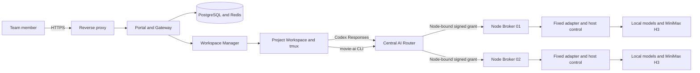

# Movie AI Workspace: Installation, Architecture, Operations, and AI Handoff

This is the single authoritative document for installing, operating, extending,
and taking over Movie AI Workspace. It contains only the final system contract
and the procedures required to operate it.

The repository is an opinionated reference implementation created from a
personal filmmaking workflow. It is not a universal server-layout template.
Before changing configuration, an administrator or coding agent must inventory
the actual GPU hosts, network, storage, model endpoints, identity boundaries,
and provider accounts, then map this contract to that environment. Preserve the
security boundaries even when the example topology does not match the target
installation.

The repository contains the control plane, bounded workflows, complete
PostgreSQL schema migrations, and sanitized bootstrap configuration. It does
not contain model weights, AI-provider credentials, Codex or Claude login
state, user media, production database records or exports, certificate keys,
or live infrastructure configuration.

## 1. Product contract

Movie AI Workspace turns one or more privately operated AI servers into a
bookable production service for a team:

- Team members reserve a specific GPU execution node through a Laravel Portal.
- A reservation opens a project-isolated Workspace with a browser terminal.
- The terminal attaches to a persistent tmux session and launches Codex. Claude
  Code may use the same project boundary when installed by the operator.
- Users choose either a private AI-plan identity or an administrator-managed
  company identity. Every identity has a separate persistent volume; tokens are
  never copied into a project or another user's identity store.
- Codex retains access to its normal hosted models and can use `/model` to select
  operator-deployed uncensored Qwen or DeepSeek endpoints.
- The `movie-ai` CLI exposes fixed image, video, MiniMax H3, Ref2VA, job, and
  media-delivery contracts.
- Projects, AI-agent instructions, sessions, and output files remain on the
  central Workspace host while GPU execution may run on another node.
- A reservation and every grant derived from it remain bound to one compute
  node. The system never silently fails over to a different server.

The Portal, multi-node reservation schema, central Router, node Broker, Worker
Compose stack, health validation, project-isolated Workspaces, media library,
and persistent AI identities are included in this repository. An additional
physical Worker is not bookable until it is separately installed, registered,
health-checked, revision-matched, and explicitly placed online.

## 2. Final architecture



### 2.1 Component responsibilities

| Component | Final responsibility |
| --- | --- |
| Reverse proxy | TLS termination and forwarding to the single Portal ingress |
| Portal | Authentication, authorization, users, projects, reservations, compute-node administration, and media links |
| PostgreSQL | Final concurrency authority for reservations and runtime ownership |
| Redis and Horizon | Queued lifecycle work and scheduled health polling |
| Workspace Manager | Creates only constrained project Workspaces and applies the selected identity volume |
| Workspace | Runs Codex, tmux, approved skills, and the `movie-ai` CLI without host control or provider secrets |
| Central AI Router | Resolves the reservation's immutable node and forwards only to that node Broker |
| Node Broker | Validates short-lived grants and bounded model/media request schemas |
| Fixed adapter | Constructs administrator-approved ComfyUI or MiniMax H3 workflows |
| Node host control | Accepts only fixed capability-level actions through a Unix socket |
| Compute Worker | Runs one node's Broker, adapter, host control, local models, and media runtime |

The central Portal is the only control plane. Remote Workers do not run Laravel,
PostgreSQL, Redis, browser terminals, Workspace images, user directories, or AI
identity volumes.

### 2.2 Public sample topology

All physical LAN examples use `192.168.88.x`:

| Role | Example |
| --- | --- |
| Portal, Workspace control plane, and primary GPU Worker | `192.168.88.20` |
| HTTPS reverse proxy | `192.168.88.30` |
| Qwen model server | `192.168.88.105` |
| DeepSeek uncensored model server | `192.168.88.106` |
| Secondary GPU Worker | `192.168.88.200` |

No public IP address belongs in Git. Real public addresses exist only in DNS,
router, firewall, or reverse-proxy configuration. `movie.example.com` and
`render.example.com` are placeholders.

The `172.30.10.x` and `172.30.20.x` ranges in `compose.yaml` are isolated Docker
bridges. They are not physical topology and must not be rewritten to match the
host LAN.

### 2.3 Security invariants

Never give a Workspace direct access to:

- the Docker socket, SSH, systemd, or a privileged host shell;
- a LAN model port, arbitrary URL, or administrator-selectable request target;
- ComfyUI or arbitrary workflow JSON;
- provider credentials, `.env`, `auth.json`, or another user's identity volume;
- another project, runtime volume, or reservation grant;
- the host-control socket or a node Broker secret.

The Browser receives only a compute-node UUID, display name, public capability
labels, availability state, and an optional busy-until timestamp. It never
receives the node IP, internal slug, Broker URL, health details, or secrets.

## 3. Compute-node and reservation contract

### 3.1 Node records and states

`compute_nodes` stores an opaque UUID, immutable slug, display name, private
IPv4 address, visibility flag, sort order, capabilities, scheduling state,
worker revision, workflow revision, optional model-manifest digest, last
heartbeat, sanitized health summary, and last error code.

Allowed scheduling states are:

| State | Meaning |
| --- | --- |
| `online` | Healthy nodes may accept new reservations |
| `draining` | Existing work may finish; no new reservations are accepted |
| `maintenance` | Administratively unavailable |
| `offline` | Intentionally disconnected and excluded from polling |

A visible node is selectable only when all of these conditions are true:

- its scheduling state is `online`;
- its signed heartbeat is newer than the configured stale threshold;
- its sanitized health summary has `ok: true`;
- its Worker and workflow revisions match required revisions when those checks
  are configured.

Public availability has three states: `idle`, `busy`, and `abnormal`. An
unhealthy node is always abnormal; a healthy node with a current occupying
reservation is busy; any other healthy online node is idle. The initial page
sorts idle, busy, then abnormal nodes and uses the configured node sort order
within each group.

New nodes are created in `maintenance` with no trusted heartbeat. They may be
visible as abnormal, but they are not selectable until validation succeeds and
an administrator changes the state to `online`.

### 3.2 Reservation invariants

Every reservation has a non-null, immutable `compute_node_id`. PostgreSQL is the
final concurrency authority and enforces:

- no overlap for occupying reservations on the same node;
- no overlap for occupying reservations owned by the same user, even across
  different nodes;
- at most one runtime owner per node;
- node-scoped and global maintenance windows;
- `RESTRICT` deletion for nodes referenced by reservations.

The occupying states are `confirmed`, `provisioning`, `active`, and `ending`.
The exclusion window is `[lock_starts_at, lock_ends_at)`, so adjacent bookings
are valid and overlapping lock windows are not.

The reservation form requires an explicit node choice before date and time
selection. Changing nodes clears the selected time. Submission revalidates the
node, heartbeat, revisions, maintenance windows, user overlap, node overlap,
time increments, duration, and database constraints. Browser availability is
advisory; the database transaction decides whether a booking succeeds.

### 3.3 Node-bound grants and failure behavior

The Portal signs a grant containing the reservation ID, user, project, expiry,
and `compute_node_id`. The central Router resolves the node from trusted server
configuration and verifies that the destination Broker reports the same node
identity. Broker state, runtime ownership, job ownership, and revocation are
all keyed by reservation and node.

If the selected Worker is unreachable, unhealthy, stale, or revision-mismatched,
the request fails closed. It is never retried on another node. An administrator
must cancel the original reservation and create a new reservation on another
node when relocation is required.

## 4. Platform prerequisites

Recommended baseline:

- Ubuntu 24.04 or another current systemd-based Linux distribution;
- Docker Engine with Compose v2-compatible `docker compose` support;
- NVIDIA driver and Container Toolkit on every GPU execution node;
- `openssl`, OpenSSH, AppArmor, `curl`, and standard systemd tools;
- a DNS name and TLS reverse proxy for browser access;
- an OpenAI Responses-compatible endpoint for each private language model;
- a validated ComfyUI and MiniMax H3 runtime on each advertised media node.

The supplied Workspace image currently targets `x86_64`; its pinned `ttyd`
binary is architecture-specific. Port and re-pin that dependency before using
an ARM64 Portal/Workspace host. Remote model endpoints may use another
architecture when they preserve the documented socket and API contracts.

PostgreSQL and Redis are supplied by the central Compose stack. The pinned Codex
CLI dependency is declared in `images/workspace/package.json` and its lockfile.
Upgrade it intentionally, rebuild the Workspace image, run all gates, and verify
`/skills` and `/model` inside a fresh Workspace.

## 5. Install the central Portal and primary Worker

### 5.1 Create private runtime configuration

```bash
sudo git clone https://github.com/linkprint/local-ai-movie-workspace.git /srv/movie-portal
cd /srv/movie-portal
sh ops/bootstrap.sh
```

The bootstrap script creates ignored configuration files and independent random
database, Redis, HMAC, Router, adapter, and seeded per-node Broker secrets
(`.20` and `.200`) without printing them. It does not overwrite an existing
secret, preserves installed file modes, copies one surviving member of a
partially missing shared-secret set, and refuses conflicting existing members.

Edit only untracked runtime files such as:

```text
.env
env/laravel.env
```

Set the real Portal bind address, reverse-proxy address, public URL, session
domain, timezone, mail transport, allowed Worker CIDRs, and model/media
upstreams. Keep SMTP credentials, provider keys, live hostnames, and production
addresses out of tracked `*.example` files.

### 5.2 Install sandbox and socket groups

Review the commands for the target distribution:

```bash
sudo install -m 0644 security/apparmor/movie-workspace-bwrap \
  /etc/apparmor.d/movie-workspace-bwrap
sudo apparmor_parser -r /etc/apparmor.d/movie-workspace-bwrap

sudo getent group movie-qwen >/dev/null || \
  sudo groupadd --system --gid 19003 movie-qwen
sudo install -m 0644 ops/tmpfiles/movie-qwen.conf \
  /etc/tmpfiles.d/movie-qwen.conf
sudo systemd-tmpfiles --create /etc/tmpfiles.d/movie-qwen.conf
```

If a fixed GID is already assigned, change the host unit and Compose
`group_add` together. Never weaken the Workspace with `privileged`,
`SYS_ADMIN`, `seccomp=unconfined`, or broad host mounts.

### 5.3 Install fixed host control

`ops/systemd/install-h3-control.sh` installs the primary node's fixed GPU
control socket. The generic defaults are `movie-comfyui.service`,
`movie-qwen.service`, and `movie-qwen-runtime`. Map them to reviewed local names
through installer environment values; the script validates and writes those
names to `/etc/movie-ai/host-control.env`. They never come from a Workspace.

```bash
sudo env \
  MOVIE_PORTAL_ROOT=/srv/movie-portal \
  MOVIE_COMFY_UNIT=movie-comfyui.service \
  MOVIE_QWEN_UNIT=movie-qwen.service \
  MOVIE_QWEN_CONTAINER=movie-qwen-runtime \
  sh ops/systemd/install-h3-control.sh
sudo systemctl is-active movie-h3-control.socket
```

Only the constrained control component receives this socket. The Workspace and
Broker do not.

### 5.4 Build, start, and migrate

```bash
docker compose build
docker compose --profile workspace-build build movie-workspace-image
docker compose up -d movie-postgres movie-redis
docker compose run --rm --no-deps movie-web php artisan migrate --force
docker compose run --rm --no-deps movie-web php artisan db:seed --force
docker compose up -d
docker compose ps
```

The database containers must start before the one-off migration container. Do
not wait for the normal `movie-web` health check on an empty database: that
health check intentionally runs `migrate:status` and cannot pass before the
schema exists.

Configure a real SMTP transport, then create the first administrator:

```bash
docker compose exec movie-web php artisan movie:create-admin \
  --name="Initial Administrator" \
  --email="admin@example.com" \
  --timezone="UTC"
```

The command refuses a production `log`/`array` mailer and refuses to create a
second administrator. It stores a random, unknown initial password and sends a
one-time password setup link. No default or plaintext password is printed,
logged, seeded, or emailed. Enroll TOTP immediately after first login.

### 5.5 Database distribution contract

The public repository carries the complete database architecture as ordered
Laravel migrations. This includes every table, foreign key, index, PostgreSQL
check and exclusion constraint, the append-only audit trigger, and the
`btree_gist` extension requirement. A production `pg_dump` is neither required
nor permitted.

Only deterministic, sanitized control-plane configuration is distributed:

| Published baseline | Purpose |
| --- | --- |
| Two `compute_nodes` templates | Stable node IDs, example `192.168.88.x` addresses, capabilities, ordering, and safe secondary-node maintenance state |
| One `company_codex_leases` singleton | Required coordination row for the administrator-managed company Codex identity |

The migrations create those rows during a new installation.
`SystemConfigurationSeeder` can restore a missing baseline row without
overwriting an operator's existing node names, addresses, states, revisions,
or health fields. `DatabaseSeeder` calls only that system seeder and never
creates a default account.

The following are deliberately excluded from Git and from public seeding:

- users, passwords, TOTP material, password-reset tokens, and sessions;
- reservations, maintenance windows, audit events, projects, profiles, and
  Workspace runtime ownership;
- queued jobs, cache entries, production node heartbeats, live revisions,
  production health history, and Broker state; the deterministic sanitized
  migration-bootstrap marker is not production telemetry;
- media, outputs, AI identities, and every PostgreSQL/Redis/runtime volume.

The public-release scanner rejects PostgreSQL data directories and common SQL,
dump, backup, SQLite, and database-export filename suffixes in both the current
tree and reachable history.

### 5.6 Publish the Portal through a reverse proxy

Forward `movie.example.com` to `192.168.88.20:8443`. Preserve the original
client address and scheme. Set `MOVIE_CADDY_IP` and `TRUSTED_PROXIES` to the
single reverse-proxy address, then apply `ops/firewall/install-rule.sh` so the
published Docker port rejects every other source.

Certificate private keys, DNS-provider tokens, real public IP addresses, and
live reverse-proxy configuration are local infrastructure state, not repository
content.

## 6. Connect language models

The Workspace exposes two operator-defined private deployment aliases:

| Model ID used by Codex | Display contract |
| --- | --- |
| `qwen3.8-27b-uncensored` | Qwen 3.8 27B Uncensored |
| `deepseek-v4-flash-0731` | DeepSeek V4 Flash 0731 Uncensored (External) |

The uncensored labels describe the operator's selected deployments. This
repository does not distribute those weights, certify a particular upstream
release, or remove the operator's responsibility for licensing, access control,
content policy, and lawful use.

An operator-controlled uncensored model can be useful in filmmaking because it
can discuss genre-specific language, difficult themes, practical effects,
continuity, and shot alternatives without a hosted consumer product unexpectedly
interrupting the creative loop. The reservation Broker still enforces resource,
network, identity, and workflow boundaries; model permissiveness does not grant
host privileges.

Each upstream must accept an OpenAI Responses-compatible request at
`/v1/responses`. The Broker maps the public alias to an administrator-configured
upstream model ID and removes unsupported hosted tools.

### 6.1 Model on the Portal or Worker host

Run Qwen on loopback port `8000` and/or the DeepSeek V4 Flash 0731 Uncensored
endpoint on loopback port `8100`. Validate `/v1/models` and `/v1/responses`
locally, then install the corresponding socket proxy:

```bash
sudo install -m 0644 ops/systemd/movie-qwen-local-proxy.socket \
  ops/systemd/movie-qwen-local-proxy.service /etc/systemd/system/
sudo systemctl daemon-reload
sudo systemctl enable --now movie-qwen-local-proxy.socket
```

Use `movie-deepseek-local-proxy.socket` and
`movie-deepseek-local-proxy.service` for the DeepSeek V4 Flash 0731 Uncensored
alias. Do not enable a local proxy and remote tunnel for the same socket.

### 6.2 Model on another private AI server

The remote model service remains bound to loopback and opens a reverse Unix
socket tunnel to the Portal or Worker that owns the reservation.

On the receiving host:

1. Create a non-login `movie-model-tunnel` account whose primary group is
   `movie-qwen`.
2. Install `ops/ssh/movie-model-tunnel.conf` under `sshd_config.d`.
3. Add only the model server's dedicated public key to that account.
4. Validate the SSH daemon configuration before reloading it.

On the model server:

```bash
sudo install -m 0644 ops/systemd/movie-model-tunnel@.service \
  /etc/systemd/system/
sudo install -d -m 0700 /etc/movie-model-tunnel
sudo install -m 0600 ops/model-tunnel/qwen.env.example \
  /etc/movie-model-tunnel/qwen.env
```

Edit only the installed, untracked file. Generate a dedicated SSH key, install
its public half on the receiver, and create
`/etc/movie-model-tunnel/known_hosts` from an independently verified host key.

```bash
sudo systemctl daemon-reload
sudo systemctl enable --now movie-model-tunnel@qwen.service
```

For the DeepSeek V4 Flash 0731 Uncensored endpoint, install the
`deepseek.env.example` instance and enable
`movie-model-tunnel@deepseek.service`. The receiving sockets are:

```text
/run/movie-qwen/qwen.sock
/run/movie-qwen/deepseek.sock
```

### 6.3 External model provider

Provider keys never enter a Workspace, Broker environment, Git repository, or
SSH tunnel unit. Run a small Responses-compatible bridge on a trusted gateway:

1. Store the provider key in a root-readable secret file or secret manager.
2. Bind the bridge only to loopback.
3. Fix the provider base URL and model allowlist in administrator-owned config.
4. Expose the bridge through the same reverse Unix-socket tunnel.

The Broker therefore receives the same keyless socket contract whether the
uncensored Qwen or DeepSeek deployment is on the local host, another LAN server,
or behind a paid external endpoint.

### 6.4 Validate model routing

On the node that owns the sockets:

```bash
test -S /run/movie-qwen/qwen.sock
test -S /run/movie-qwen/deepseek.sock
docker compose exec movie-ai-broker python3 -c \
  'import urllib.request; print(urllib.request.urlopen("http://127.0.0.1:8080/healthz").read().decode())'
```

Inside a new reserved Workspace:

1. Run `/model` and verify `qwen3.8-27b-uncensored` and
   `deepseek-v4-flash-0731` labelled as uncensored are present.
2. Select each private model and send a bounded text-only prompt.
3. Confirm the Router logs only the route and body size, never prompt bodies,
   headers, or credentials.
4. Switch back to an OpenAI model and confirm normal Codex routing resumes.

Socket presence is not a model acceptance test. A real check requires a valid
model response through the complete Workspace-to-Broker route.

## 7. Connect MiniMax H3 and media models

Set the node-local ComfyUI upstream only in ignored configuration:

```dotenv
MOVIE_COMFY_UPSTREAM=http://192.168.88.20:8188
```

The adapter exposes fixed HTTP routes. The reservation-bound Broker validates
the public request and constructs the workflow; the adapter validates route,
size, JSON syntax, upload shape, and artifact paths but does not independently
approve every ComfyUI node. Keep the adapter on its isolated Broker network and
never publish it. Model paths, LoRAs, samplers, service names, and GPU power
policy remain on the administrator side.

Copy `reference-workflows/model-manifest.example.json` outside Git, then fill in
every weight's source URL, destination, SHA-256, and license plus every custom
node's source URL, pinned revision, destination, and license. Set all operator
review flags only after verification. Hash the completed manifest and set
`MOVIE_MODEL_MANIFEST_SHA256` in the node's ignored environment.
The Broker validates the digest shape and returns it from `/healthz`; the Portal
records it with the node health summary. The repository intentionally provides
expected filenames, destination templates, and required class types, not model
downloads, unverified third-party source claims, or license approval.

The normal CLI flow is:

```bash
movie-ai gpu status
movie-ai h3 generate \
  --spec project-shot.json \
  --workflow-preset standard \
  --content-profile general \
  --wait
movie-ai job list
movie-ai job download JOB_ID --output /outputs/shot.mp4
movie-ai video url /outputs/shot.mp4
```

Native Ref2VA specifications may contain up to nine images and three reference
videos of 2-15 seconds, subject to the source validation contract. Invoke
`$h3-video-generation` before submission. Completion requires downloading the
artifact, running `ffprobe`, and performing visual and audio review.

External style or image services use `MOVIE_STYLE_UPSTREAM` and the untracked
`env/movie_style_basic_credentials` secret. Disable the user-visible capability
when no trusted upstream is configured. Never commit a placeholder as a live
credential.

## 8. Install an additional Compute Worker

### 8.1 Worker boundary

The example secondary Worker is `192.168.88.200`. Install the reviewed source
at `/srv/movie-worker`. A remote Worker needs only:

```text
compose.worker.yaml
env/worker.env.example
images/control/
host-control/
ops/bootstrap-worker.sh
ops/render-node-secret-override.py
ops/systemd/worker/
reference-workflows/
```

Do not copy the central database, Redis data, project volumes, output volumes,
Workspace image, user directories, identity state, Broker state, or Portal
secrets to a Worker. Install the node's ComfyUI, MiniMax H3, local image models,
language-model endpoints, drivers, and systemd units separately from reviewed
operator configuration.

### 8.2 Worker secrets

Every secret must contain at least 32 random bytes and remain outside Git. Each
node receives unique secrets for these boundaries:

| Worker file | Shared with | Purpose |
| --- | --- | --- |
| `env/node_broker_hmac_secret` | Central Router's node-specific secret | Router to node Broker |
| `env/node_control_hmac_secret` | Node Broker and node-control bridge | Broker to fixed control bridge |
| `env/h3_control_hmac_secret` | Node-control bridge and host service | Control bridge to systemd socket |
| `env/movie_style_basic_credentials` | Node adapter only | Optional trusted style upstream |

Do not reuse the Portal-to-control-plane secret, another node's Broker secret,
or a provider credential. With the supplied file mounts, the shared Worker
files use `root:nogroup 0440` and the `env` directory uses `root:root 0700`.

Generate the ignored Worker files before applying root ownership:

```bash
sh ops/bootstrap-worker.sh
```

The script works with the documented Worker-only file set and does not require
the central `.env.example`. It never prints secret values. Securely transfer the
exact Worker `node_broker_hmac_secret` to the central Router mapping; do not run
two independent generators and assume their results match.

```bash
sudo chown root:root env
sudo chmod 0700 env
sudo chown root:nogroup \
  env/node_broker_hmac_secret \
  env/node_control_hmac_secret \
  env/h3_control_hmac_secret \
  env/movie_style_basic_credentials
sudo chmod 0440 \
  env/node_broker_hmac_secret \
  env/node_control_hmac_secret \
  env/h3_control_hmac_secret \
  env/movie_style_basic_credentials
```

### 8.3 Worker environment

Create ignored `env/worker.env` from the example and set values for the exact
registered node:

```dotenv
MOVIE_COMPUTE_NODE_ID=20000000-0000-4000-8000-000000000200
MOVIE_WORKER_BIND_IP=192.168.88.200
MOVIE_COMFY_UPSTREAM=http://192.168.88.200:8188
MOVIE_WORKER_REVISION=DEPLOYED_GIT_SHA
MOVIE_WORKFLOW_REVISION=APPROVED_WORKFLOW_REVISION
MOVIE_MODEL_MANIFEST_SHA256=SHA256_OF_COMPLETED_OPERATOR_MANIFEST
MOVIE_STYLE_UPSTREAM=https://render.example.com
```

The node UUID must match the Portal record and Broker health response exactly.
The bind address must be a permitted private IPv4 address. Restrict TCP port
`8080` so only the central Router host can reach it.

### 8.4 Worker host control and containers

The supplied Compose contract uses GID `19002` for fixed H3 control and `19003`
for model sockets. Verify both sides before starting:

```bash
sudo getent group movie-h3-control >/dev/null || \
  sudo groupadd --system --gid 19002 movie-h3-control
sudo getent group movie-qwen

sudo install -d -m 0755 /etc/movie-ai
sudoedit /etc/movie-ai/host-control.env

sudo install -m 0644 ops/systemd/worker/movie-h3-control.socket \
  /etc/systemd/system/movie-h3-control.socket
sudo install -m 0644 ops/systemd/worker/movie-h3-control.service \
  /etc/systemd/system/movie-h3-control.service
sudo systemctl daemon-reload
sudo systemctl enable --now movie-h3-control.socket movie-h3-control.service

docker compose --env-file env/worker.env -f compose.worker.yaml build
docker compose --env-file env/worker.env -f compose.worker.yaml up -d
docker compose --env-file env/worker.env -f compose.worker.yaml ps
```

The non-secret host-control file contains only reviewed fixed names, for
example:

```dotenv
MOVIE_COMFY_UNIT=movie-comfyui.service
MOVIE_QWEN_UNIT=movie-qwen.service
MOVIE_QWEN_CONTAINER=movie-qwen-runtime
```

If a GID is occupied by another group, stop and change the systemd and Compose
configuration together. A one-sided GID change breaks socket access.

### 8.5 Register and activate the Worker

In `/admin/ai-servers`, create the node with a unique display name and an IPv4
address allowed by `MOVIE_ALLOWED_NODE_CIDRS`. The system generates the UUID
and immutable slug and starts the node in `maintenance`.

After registration, securely install the Worker's Router-to-Broker secret under
`env/` on the central host and generate an ignored Compose override. The helper
validates the UUID and filename and never reads or emits the secret value:

```bash
python3 ops/render-node-secret-override.py \
  --node 30000000-0000-4000-8000-000000000300=node_broker_hmac_secret.300 \
  > compose.node-secrets.yaml

docker compose -f compose.yaml -f compose.node-secrets.yaml config --quiet
docker compose -f compose.yaml -f compose.node-secrets.yaml up -d movie-ai-router
```

Repeat `--node UUID=FILENAME` for every locally added Worker. Always include the
same override file in later central `build`, `up`, `ps`, and recovery commands.
The two seeded nodes remain in the base Compose file; additional UUIDs require
no tracked Compose edit.

Before changing it to `online`, confirm from the central Router network that
`http://192.168.88.200:8080/healthz` returns:

- the exact registered `compute_node_id`;
- the deployed Worker revision;
- the approved workflow revision;
- the expected capability list;
- a healthy sanitized summary;
- any configured model-manifest digest.

Then wait for the Portal heartbeat to show the same identity and revisions,
run a bounded canary, and set the scheduling state to `online`. Validate that:

- two different users can reserve two different nodes at the same time;
- one user cannot hold overlapping reservations across nodes;
- one node cannot receive overlapping reservations;
- a stopped selected Worker fails closed without using another node;
- the reservation API never returns a private IP or internal Broker URL.

Use the same contract for every additional Worker: unique UUID, unique private
IP, unique Router-to-Broker secret, matching revision, health verification,
bounded canary, and explicit online state.

## 9. Codex, Claude Code, identity, and tmux handoff

The browser terminal launches:

```text
tmux new-session -A -s movie -c /workspace/<project>
```

The session survives browser reconnects while the Workspace is active. Project
files and `/outputs` use persistent volumes; the container is disposable.

Personal mode uses one private `CODEX_HOME` per Portal user. Company mode uses
an administrator-managed identity volume only for operators licensed and
authorized under the provider's terms. Never share a plaintext token or copy
`auth.json`. Continuity comes from the repository, `AGENTS.md`, durable project
documents, commits, and explicit session handoff.

Claude Code is not bundled. When installed, keep its login in an equally
isolated per-user volume, start it inside the selected project and tmux
boundary, and require it to read `CLAUDE.md` and `AGENTS.md`. It receives no
broader host or network privileges than Codex.

## 10. Guarantee Workspace skill discovery

Codex recognizes `/etc/codex/skills` as an administrator skill scope and
`.agents/skills` as a repository scope. The Workspace image copies approved
skills into `/etc/codex/skills`, owned by root and not writable by the Workspace
user. These paths and the explicit `$skill-name` invocation contract follow the
official [Codex skill documentation](https://developers.openai.com/codex/skills/).

The enforced chain is:

1. `images/workspace/Dockerfile` copies every approved skill into the official
   administrator path.
2. Directories are `0755`, files are `0644`, and ownership is `root:root`.
3. Startup runs `movie-ai skills verify` and fails closed when a required
   `SKILL.md`, matching `name`, nonempty `description`, or read-only permission
   is missing.
4. Acceptance in a fresh Workspace runs `/skills` and explicitly invokes a safe
   test skill by `$name`.

Useful checks are:

```bash
movie-ai skills verify
find /etc/codex/skills -maxdepth 2 -name SKILL.md -print
```

Safety-critical generation explicitly invokes
`$h3-prompt-writing` or `$h3-video-generation`; implicit skill discovery is not
the only control. A skill that must never activate implicitly may set
`policy.allow_implicit_invocation: false` in `agents/openai.yaml`; explicit
`$skill-name` invocation remains available.

To add a skill:

1. Add `images/workspace/admin-skills/<name>/SKILL.md` with a matching `name`
   and precise trigger description.
2. Add optional `agents/openai.yaml`, references, and deterministic scripts.
3. Add the corresponding `COPY` instruction to the Workspace Dockerfile.
4. Add it to the required set only when every deployment must provide it.
5. Extend static tests, rebuild the image, enter a fresh Workspace, run
   `/skills`, and explicitly invoke the skill.

## 11. Development map and change contract

| Area | Primary paths |
| --- | --- |
| Portal, reservations, node administration, and media libraries | `app/` |
| Central Router, Workspace Manager, node Broker, and adapter | `images/control/` |
| Codex, tmux, CLI, model Router, and skills | `images/workspace/` |
| Host GPU control | `host-control/` and `ops/systemd/` |
| Remote Worker deployment | `compose.worker.yaml`, `env/worker.env.example`, and `ops/systemd/worker/` |
| Ingress and isolation | `gateway/`, `egress/`, and `security/` |
| Fixed workflow references | `reference-workflows/` |
| Tests and public-release scan | `ops/tests/` |

Text-model request path:

```text
Codex -> loopback router -> reservation grant -> central Router
      -> selected node Broker -> fixed Unix socket -> model endpoint
```

Media request path:

```text
Codex -> movie-ai CLI -> reservation grant -> central Router
      -> selected node Broker -> fixed adapter -> model runtime
```

Any change must update validation, authorization, tests, and documentation at
every affected boundary. Never trust a Worker URL, model URL, project path,
identity, reservation ID, or node ID supplied by a Workspace.

## 12. Tests and acceptance

Run repository checks from the root:

```bash
python3 -m unittest discover -s ops/tests -p 'test_*.py'
sh ops/tests/gate4-static.sh
python3 ops/tests/public_release_scan.py --tree
```

Useful operator tooling that must be run deliberately includes:

- `ops/deploy/gate2-migrate.sh` for a guarded first-schema migration;
- `ops/deploy/pin-images.py` for immutable image digest updates;
- `ops/systemd/install-boot-recovery.sh` and `remove-h3-control.sh` for host lifecycle;
- `ops/tests/gate2-static.sh`, `gate3-static.sh`, `gate3-runtime-smoke.sh`, and
  `qwen_codex_smoke.py` for progressively stronger acceptance;
- `ops/create-public-snapshot.sh` for a generic-author, single-root export.

Run Portal tests from `app/` after installing locked dependencies:

```bash
composer install
npm ci
php artisan test
npm run build
```

`gate4-static.sh` requires Compose v2. If that command is unavailable it prints
`NOT_RUN` and exits with status 2; do not treat its preceding partial checks as
a complete pass.

A deployment is accepted only when all applicable checks succeed:

- TLS, authentication, TOTP, role boundaries, and trusted-proxy behavior;
- node selection, node-scoped availability, database concurrency constraints,
  and maintenance windows;
- heartbeat identity, revision, capability, and stale-node rejection;
- Workspace entry, tmux reconnect, project persistence, and identity isolation;
- `/skills`, explicit skill invocation, and fail-closed skill verification;
- hosted Codex routing plus a real response from each configured uncensored
  private model;
- a bounded MiniMax H3 job, downloaded artifact, `ffprobe`, and visual review;
- selected-node failure with no silent failover;
- absence of secrets, public IPs, private runtime files, and sensitive metadata
  from the tracked tree and reachable history.

## 13. Backup, maintenance, and recovery

Back up separately:

- PostgreSQL and Redis named volumes;
- Portal storage, projects, outputs, and media libraries;
- per-user and company AI identity volumes;
- local secrets through an encrypted secret-management process;
- installed systemd, AppArmor, firewall, and reverse-proxy configuration;
- node Broker state required to revoke or reconcile active grants.

Backups never enter Git.

For maintenance, stop new reservations, wait for or explicitly cancel active
work, back up state, build immutable images, run tests, migrate the database,
and replace only affected services. Keep prior image tags and persistent
volumes. A healthy `/up` response does not prove model routing, Workspace entry,
skills, reservation enforcement, or media generation.

Set a Worker to `draining` before planned removal. Use `maintenance` for an
immediate administrative stop and `offline` only when it is intentionally
disconnected. Do not change the IP or node identity of a Worker with active
reservations. Forced cancellation must revoke the node grant and Workspace AI
network before releasing the time window while preserving projects, identities,
outputs, and audit records.

## 14. AI takeover contract

Give a new coding agent this prompt from the repository root:

```text
Read AGENTS.md, CLAUDE.md if applicable, and
docs/AI_INSTALL_AND_OPERATIONS_GUIDE.md completely. Run git status --short and
preserve every existing change. Inventory the actual Portal, compute nodes,
network, storage, model endpoints, and identity boundaries before editing; the
192.168.88.x addresses are examples, not a deployment prescription. Trace the
requested behavior through Portal -> Workspace Manager -> central Router ->
selected node Broker -> fixed adapter or model socket. Never read or print .env,
Docker secrets, auth.json, user media, runtime volumes, or provider credentials.
Run focused tests, gate4-static.sh, and the public-release tree scan. Do not
deploy, submit a real GPU job, commit, push, publish, or change external state
unless explicitly authorized.
```

This contract lets Codex or another coding agent take over the system without
receiving production secrets or assuming that the reference network matches the
target environment.

## 15. Public distribution boundary

A public release is a sanitized snapshot with no private development history.
The tracked tree and every Git object, including unreachable local objects, must
pass `ops/tests/public_release_scan.py`. Supply an untracked newline-delimited
private-identifier file with `--deny-identifiers-file` during release so names,
internal codenames, and private FQDNs can be checked without publishing hashes
or the identifiers themselves. Use only placeholder domains, generic author
metadata, and `192.168.88.x` physical-LAN examples. A clean current tree does
not make old commits safe.

Never publish private runtime files, credentials, AI identities, model weights,
user media, production database records or exports, public IP addresses, or
live infrastructure configuration. Complete schema migrations and sanitized
bootstrap configuration are the intentional exception. Revoke and rotate any
credential that was ever committed or shared; removing it from Git cannot
recall old clones or caches.
